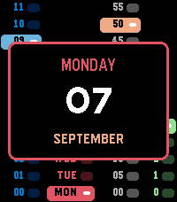
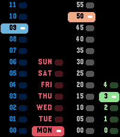
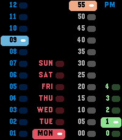

# LED Watch

*The binary LED watch, one lit cell per column.*

  

A Pebble watchface (v1.0.0).

LED Watch brings back the column display of a binary LED wristwatch — and
makes it readable.

Four columns stand side by side, twelve rows tall, counting upwards from the
bottom: the hour in blue, the weekday in red, the minutes in blocks of five
in orange, and the single minutes in green. Exactly one cell in each column
is lit at any moment. The lit cell is a solid bar of its colour with the
label set in black on top, so the current value carries across the room while
the dark cells stay as quiet context around it.

Add the two right-hand columns to read the minutes: 50 and 3 is 53.

Two changes make it easier to read than the watches it borrows from. The
minute blocks start at 00 rather than 05, and the single minutes run 0 to 4
rather than 1 to 5 — so something is always lit in every column and the sum
is never ambiguous. And on a 24-hour watch the hour column simply shows 00
to 23 instead of asking you to check an AM/PM lamp; set to 12 hours it shows
1 to 12 and the PM field appears in the top corner.

Shake your wrist and the date slides in over the grid — weekday, day of the
month, month. Shake again for the ISO calendar week and its year. A third
shake returns to the time, and so does simply waiting a few seconds. No
buttons, no menus, nothing to hold down.

Built for Pebble Time 2, using the full height of its display: twelve rows
of nineteen pixels, edge to edge.

## Settings

None. The watchface reads the system 12/24-hour setting and needs nothing
else.

## Platforms

- Pebble Time 2 (`emery`)

## Building

With the [Pebble SDK](https://developer.repebble.com/sdk/):

```bash
pebble build
pebble install --emulator emery
```

The repository can also be imported into CloudPebble as is.

## Release notes

### 1.0.0

First release.
